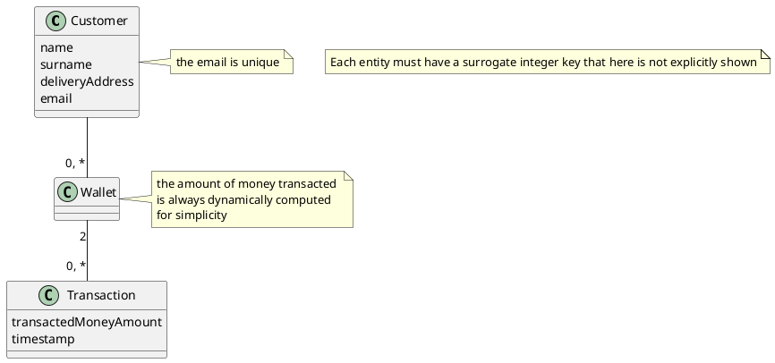
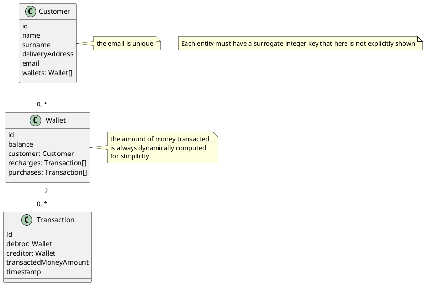

# Whiteboard

## High-level model

```plantuml
@startuml

class Customer {
    name
    surname
    deliveryAddress
    email
}
class Wallet {
}
class Transaction {
    transactedMoneyAmount
    timestamp
}

Customer -- "0, *"  Wallet
Wallet "2" -- "0, *" Transaction

note "Each entity must have a surrogate integer key that here is not explicitly shown" as N1
note right of Wallet: the amount of money transacted \nis always dynamically computed \nfor simplicity
note right of Customer: the email is unique

@enduml
```

## Low-level model

```plantuml
@startuml

class Customer {
    id
    name
    surname
    deliveryAddress
    email
    wallets: Wallet[]
}
class Wallet {
    id
    balance
    customer: Customer
    recharges: Transaction[]
    purchases: Transaction[]
}
class Transaction {
    id
    debtor: Wallet
    creditor: Wallet
    transactedMoneyAmount
    timestamp
}

Customer -- "0, *"  Wallet
Wallet "2" -- "0, *" Transaction

note "Each entity must have a surrogate integer key that here is not explicitly shown" as N1
note right of Wallet: the amount of money transacted \nis always dynamically computed \nfor simplicity
note right of Customer: the email is unique

@enduml
```